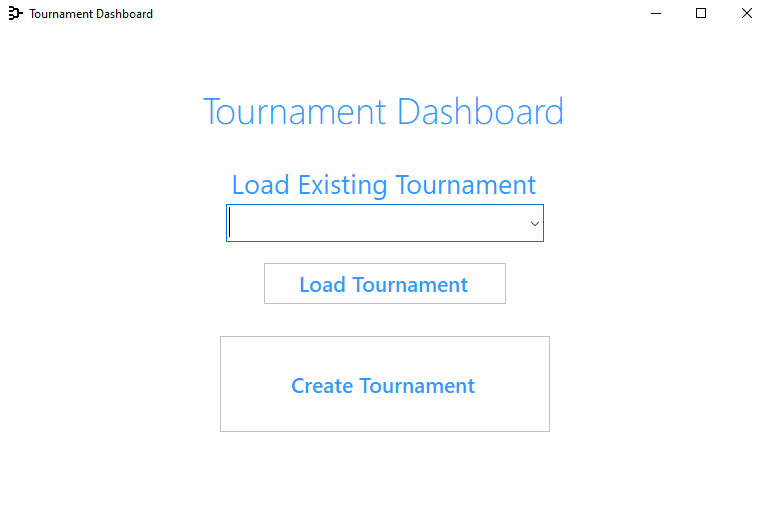
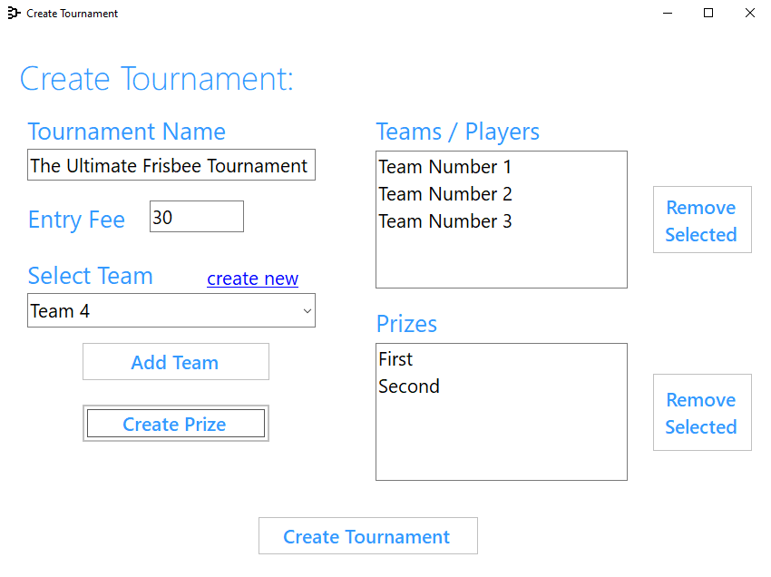
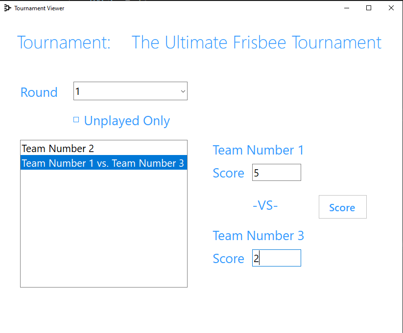
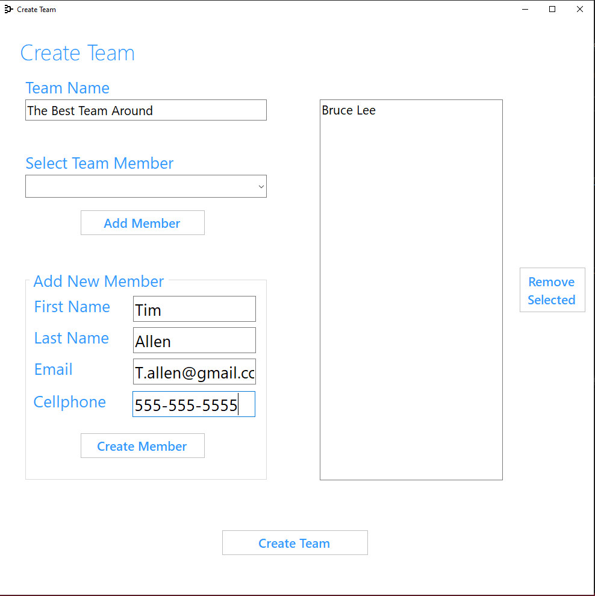

# TournamentTracker
This winform project tracks matches in an elimination style tournament. Players, teams, prizes, and the tournament are stored in a SQL database.

#

#

#

#

# To run
1. Clone the repo
2. Build the application

# What I learned
This project was made using Tim Corey's ~24-hour long C# tutorial found at https://www.youtube.com/watch?v=wfWxdh-_k_4&t=29308s

1. Principles of programming. Tim Corey goes through his rationale for his decision making and that is what makes the tutorial so long.
2. How to debug. Given that I was typing along with the tutorial, I introduced a lot of bugs that I had to debug.
3. I improved my understanding of storage and retrieval in SQL.
4. This was the first time I used Stored Procedures. They were not all explicitly explained so this was a good exposure in practice and in debugging.

# Future Directions: 
* Unit testing